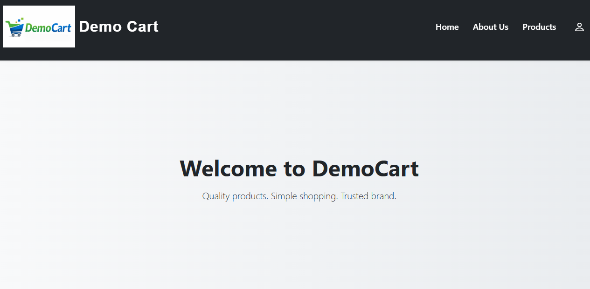
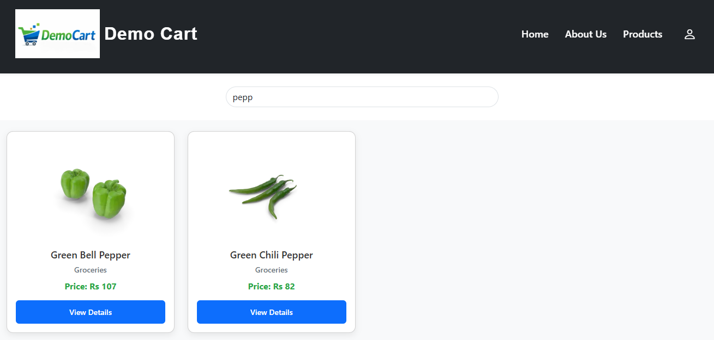
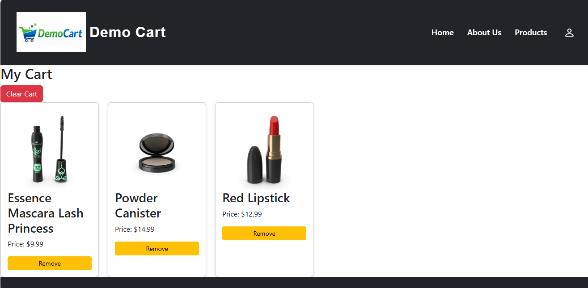
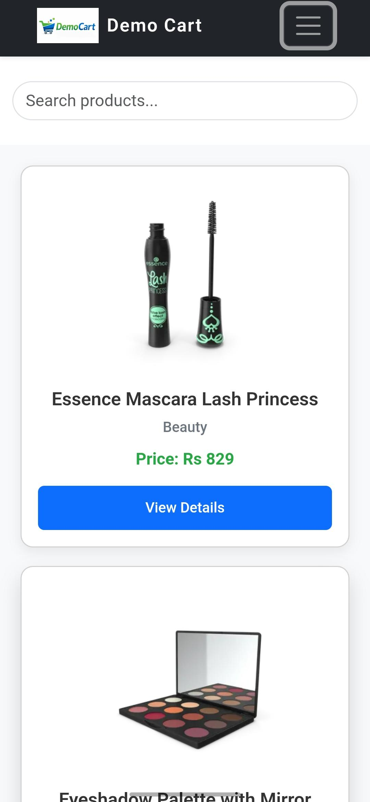

#  E-Commerce Website

## Project Overview

This project is a responsive E-Commerce Website developed using Angular as part of the DecodeLabs Internship Program. The application allows users to browse products, view product details, manage a shopping cart and wishlist, and navigate through a modern user-friendly interface.

The project demonstrates frontend development concepts including component-based architecture, routing, API integration, responsive design, and state management.

---

##  Live Demo

https://task-1-krishna-prakash-e-commerce-w.vercel.app/

---

##  GitHub Repository

https://github.com/KrishnaPrakashh/Task-1-KrishnaPrakash-ECommerce_web

---

##  Features

* Responsive design for mobile, tablet, and desktop devices
* Product listing page
* Product details view
* Shopping cart functionality
* Wishlist management
* Login page UI
* API-based product fetching
* Navigation using Angular Routing
* Modern and user-friendly UI
* Reusable Angular components

---
## Note

The Login page included in this project is currently a user interface implementation intended for demonstration purposes. Backend authentication and user account management are not implemented in this version of the application.


##  Technologies Used

### Frontend

* Angular
* TypeScript
* HTML5
* CSS3
* Bootstrap

### API

* DummyJsons / Product API

### Deployment

* Vercel

### Version Control

* Git
* GitHub

---

##  Project Structure

```text
src/
│
├── app/
│   ├── navbar/
│   ├── footer/
│   ├── home/
│   ├── product/
│   ├── cart/
│   ├── wishlist/
│   ├── login/
│   └── about/
│
├── assets/
├── environments/
└── styles.css
```

---

##  Responsive Design

The application has been designed and tested for:

* Mobile Devices
* Tablets
* Laptops
* Desktop Screens

Responsive navigation and layouts ensure a smooth user experience across different screen sizes.

---

##  Application Workflow

1. User visits the website.
2. Products are fetched from the API.
3. User can browse available products.
4. Products can be added to the cart.
5. Products can be added to the wishlist.
6. User can navigate through different pages using Angular routing.
7. Responsive UI adapts to different devices.

---

##  Installation

Clone the repository:

```bash
git clone https://github.com/KrishnaPrakashh/Task-1-KrishnaPrakash-ECommerce_web.git
```

Navigate to the project folder:

```bash
cd Task-1-KrishnaPrakash-ECommerce_web
```

Install dependencies:

```bash
npm install
```

Run the development server:

```bash
ng serve
```

Open your browser and visit:

```text
http://localhost:4200
```

---

##  Build for Production

```bash
ng build
```

---

##  Screenshots

### Home Page



### Products Page



### Cart Page



### Footer 


### Mobile View



---

##  Learning Outcomes

Through this project, I gained experience in:

* Angular component architecture
* Routing and navigation
* API integration
* Responsive web design
* State management concepts
* Git and GitHub workflow
* Project deployment using Vercel

---

##  Author

**Krishna Prakash**

---

## 🎓 Internship

DecodeLabs Internship Program

Project 1 – Full Stack Development (E-Commerce Website)
